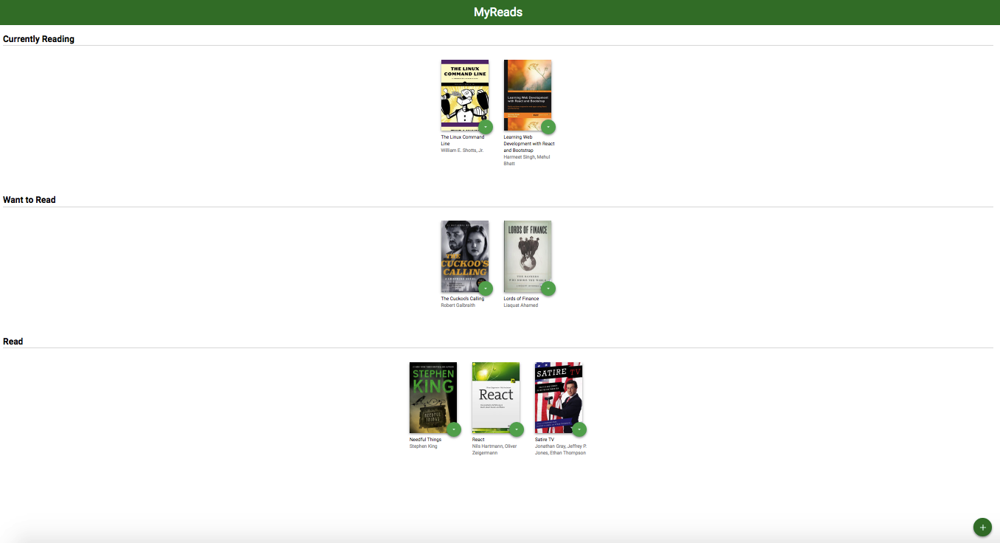
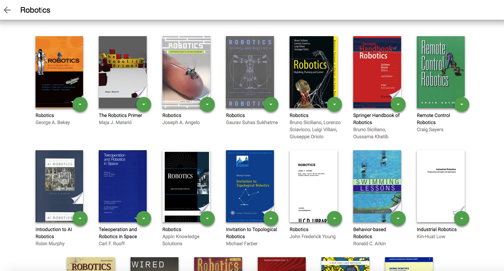

# MyReads Project

## Description
The MyReads  allows you to select and categorize books you have read, are currently reading, or want to read. The project uses an API server and client library that you will use to persist information as you interact with the application.

## How it works

## Screenshots

### Main page

### Search page

 ## installing and launching the project
 In command line:
    1. At first type in terminal `npm install`
    2. To start application run `npm start`